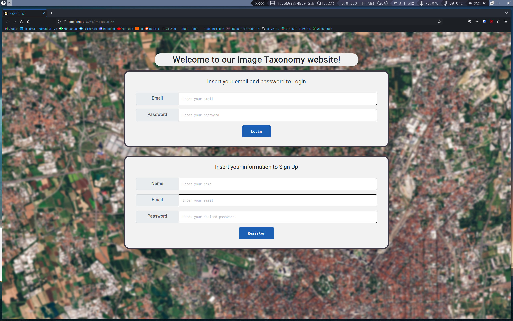
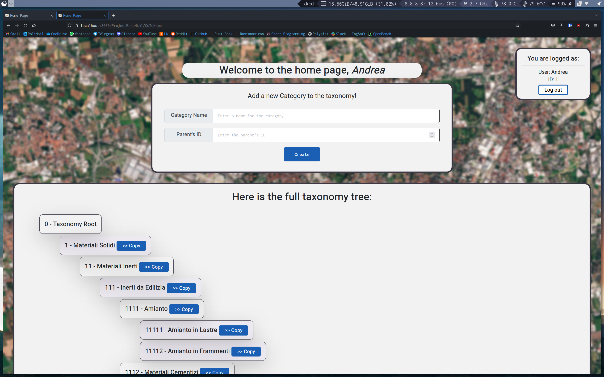
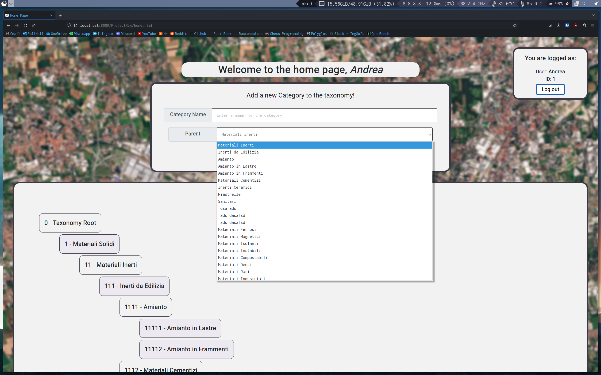
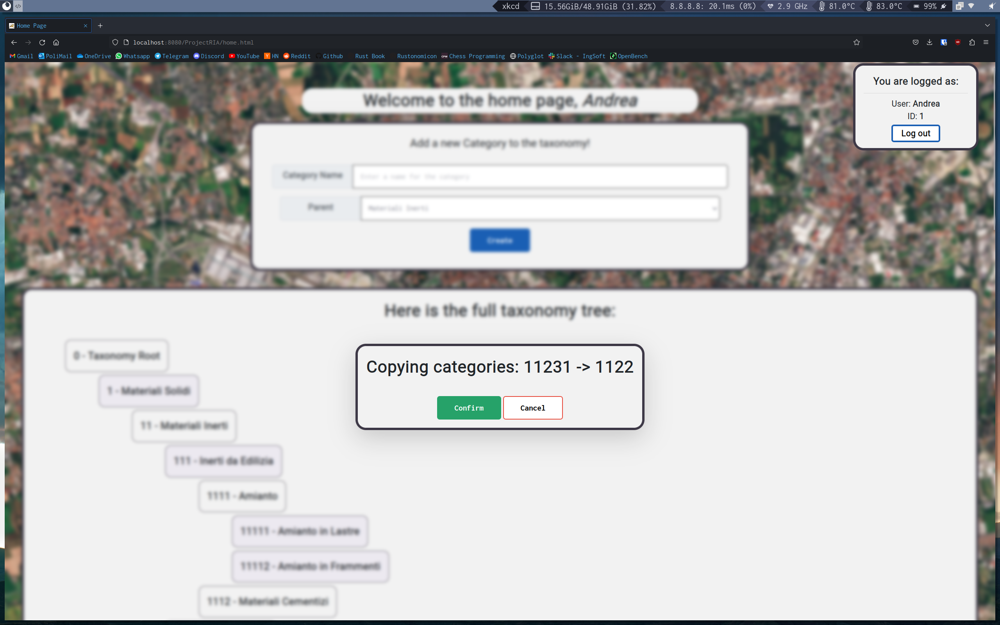
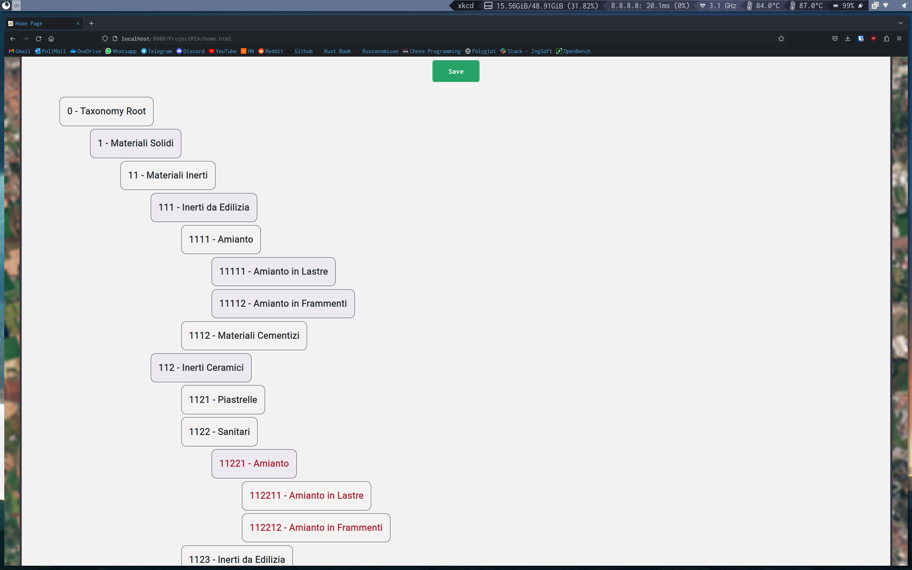

# Web Technologies - Final Project 2022-2023 (Track 3)

Aim of the project is to build two versions of the same web application. The first one delivers pure HTML content, handling
all the logic server-side, while the second one uses Javascript client-side to deliver all functionality in a single page.

## Photos

* Login Screen

* Home Page (HTML version)

* Home Page (RIA version)

* Copy Dialog box

* Local copy

